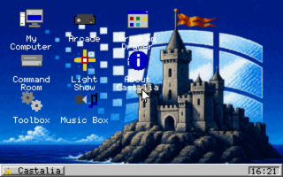
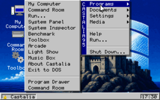
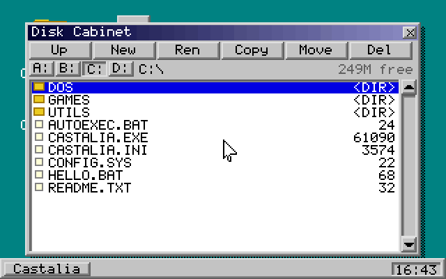
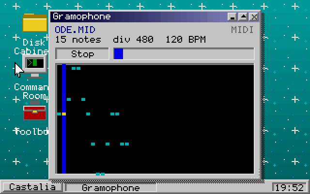
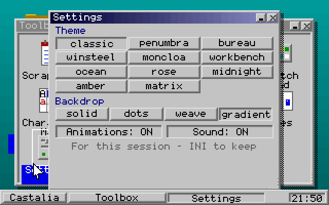
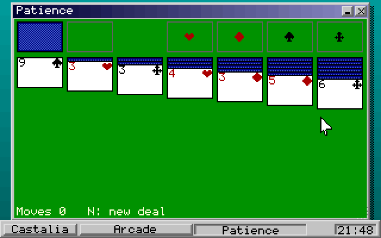
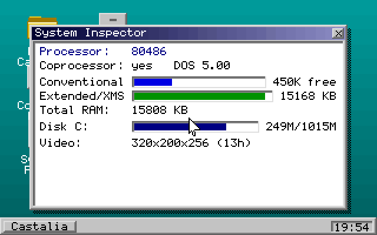
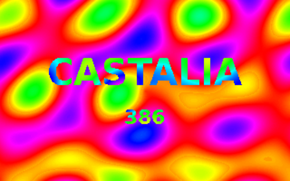
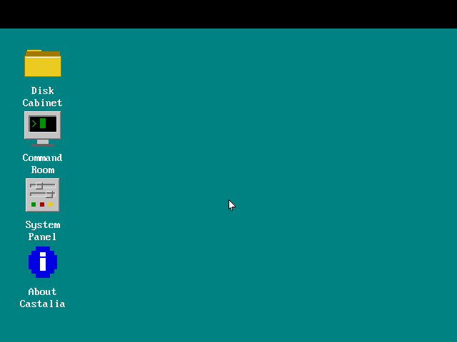

<div align="center">


# Castalia 92

### The Windows 95 your 386 was promised — three years early, and 120 KB small.

A complete graphical desktop for MS-DOS. Overlapping windows, a taskbar, a Start
menu, a file manager, thirty-odd programs, thirteen games and a demoscene
screensaver — on a 386SX with 1 MB of RAM, in a single `.EXE`, with **zero**
external libraries.

[](https://github.com/Tombatossals-Softworks-LLC/CastaliaOS-92/actions/workflows/ci.yml)
[](https://github.com/Tombatossals-Softworks-LLC/CastaliaOS-92/actions/workflows/regress.yml)
[](README.TXT)
[](LICENSE)
[](BUILD.TXT)
[](BUILD.TXT)
[](#the-numbers)



**[Download](#get-it-running) · [Screenshots](#the-tour) · [Build from source](#build-it-yourself) · [Manual](README.TXT)**

</div>

---

## Why this exists

In 1992 a 386SX with 4 MB of RAM was a serious machine, and what it got was a
C:\ prompt. Castalia 92 is the desktop that hardware deserved: it boots to a
mouse pointer in under a second, keeps about 120 KB resident, and launches your
ordinary DOS programs — or unloads itself **completely** so a big game gets
every last kilobyte back.

It is not an emulator, not a toy mock-up, and not a themed web page. It is a
real-mode DOS binary, written in C89, that draws every pixel itself.

- **It runs on the metal.** Verified on real 386-class hardware, not just in a
  virtual machine. The minimum spec is *enforced* at start-up, politely, at the
  DOS prompt.
- **It has no dependencies.** Not one library. VGA, mouse, keyboard, timer,
  Sound Blaster, OPL2 and the FAT filesystem are all driven directly.
- **It is one file.** `CASTALIA.EXE`. Copy it to a floppy and it works.
- **It is finished software, not a demo.** Thirty programs, thirteen games,
  eighteen themes, sixteen screensaver effects — all in the box.

## The tour

| | |
|:--:|:--:|
| <br>**The Dominus menu** — cascading, with flyouts and per-item icons | <br>**Disk Cabinet** — browse, launch, copy, rename, delete |
| <br>**Gramophone** — real MIDI on an OPL2, WAV on a Sound Blaster | <br>**Settings** — live theme preview, applied without a restart |
| <br>**Patience** — one of thirteen games, with the winning cascade | <br>**System Inspector** — CPU, XMS and disk read off the machine |
| <br>**The Light Show** — sixteen demoscene effects, all fixed-point | <br>**640×480×16** — the same desktop, the other video mode |

Eighty-seven more shots are in [`docs/screenshots/`](docs/screenshots), indexed
at the top of [README.TXT](README.TXT).

## Get it running

### On DOS (real hardware, DOSBox, 86Box, PCem…)

1. Grab the ready-to-run bundle: the [latest release](https://github.com/Tombatossals-Softworks-LLC/CastaliaOS-92/releases),
   or the [`release/`](release) folder in this repository — it is committed on
   purpose, and CI keeps it in step with the source on every merge.
2. Copy it onto the DOS machine and run the installer (or just copy the files
   into one directory; the installer is a convenience, and it never touches
   `AUTOEXEC.BAT` unless you ask it to):

   ```
   INSTALL            REM the graphical setup, into C:\CASTALIA
   CD \CASTALIA
   CASTALIA
   ```

   `INSTALL` starts `INSTALL.EXE`, a Castalia-styled setup with an editable
   target path and a progress bar — DOS looks for `.EXE` before `.BAT`. Type
   `INSTALL.BAT` in full for the zero-tools batch installer instead.

3. Load a mouse driver first (`CTMOUSE`, `MOUSE.COM`) if you want the pointer.

### In DOSBox, in thirty seconds

```sh
git clone https://github.com/Tombatossals-Softworks-LLC/CastaliaOS-92.git
dosbox -c "mount c CastaliaOS-92/release" -c "c:" -c "CASTALIA.EXE"
```

### Requirements

| | Minimum (enforced at start-up) | Recommended |
|---|---|---|
| **CPU** | Intel 386SX | 486 or better |
| **RAM** | 1 MB (conventional + XMS) | 4–8 MB |
| **Video** | VGA — 320×200×256 or 640×480×16 | Either; both are first-class |
| **Input** | Keyboard | Microsoft-compatible mouse (INT 33h) |
| **Sound** | PC speaker | Sound Blaster, AdLib/OPL2, Covox, Disney Sound Source |
| **OS** | DOS 3.3+ (real mode, no extender) | MS-DOS 6.22 or FreeDOS |

## What's in the box

**The desktop** — overlapping windows you can drag, resize, minimize, maximize,
shade and cascade. A taskbar with one button per window, a tray and a live
clock. Windows zoom out of whatever launched them and fly back into their
taskbar button. Desktop icons drag between grid slots and load genuine Windows
`.ICO` files.

**The programs (30+)** — Disk Cabinet (file manager), Scribe's Desk (editor with
find and word wrap), Sketch Pad (paint and icon editor), Gramophone (media
player with a spectrum analyzer and folder playlists), System Inspector,
Benchmark, calculator, calendar, agenda, hex viewer, character map, Mandelbrot
explorer, stopwatch, Find File, Picture Show, Cinema (FLI/FLC player), and the
Eyes — which follow the pointer, blink, and judge.

**The games (13)** — Minefield, Patience, Reversi, Serpent, Breaker, Quadrix,
Depot, Echo, Lights Out, Fifteen, Tic-Tac-Toe, Pong and 2048. All with sound and
persistent high scores.

**The themes (18)** — classic, penumbra, bureau, winsteel, moncloa, workbench
(an Amiga homage), ocean, rose, midnight, amber, matrix, redmond, sunset,
forest, hotdog, slate, sakura and dos. Every one restyles every pixel of chrome,
previews live before you commit, and cross-fades when applied.

**The Light Show (16 effects)** — plasma, copper bars, a warp starfield, fire,
the Boing ball, a rotozoomer, a tunnel, matrix rain, vector balls, a sine
scroller, a twister, fireworks, a wireframe cube, a voxel terrain flyover, a
textured raycast corridor and a DAC-cycled kaleidoscope. All fixed-point
integer maths on one shared sine table. No FPU. No cheating.

**The sound** — polyphonic General-MIDI on an AdLib/OPL2 FM chip, digital WAV on
a Sound Blaster, a Covox Speech Thing or a Disney Sound Source on the printer
port, and pulse-width tricks on the bare PC speaker when that is all there is.

Everything is configurable from one commented file, [`CASTALIA.INI`](CASTALIA.INI):
theme, video mode, wallpaper, screensaver delay, sound, launcher shortcuts, and
per-slot colour overrides.

## The numbers

| | |
|---|---|
| Resident size | ~120 KB (and it can unload itself entirely) |
| Source | 65 C modules, ~33,000 lines of C89 |
| External dependencies | **none** — not one library |
| Toolchain | Open Watcom C/C++ 2.0, pinned to one snapshot in CI (1.9 also builds clean) |
| Memory model | medium: far code, near data, explicit `far` for VGA buffers |
| Warnings | maximum **and** fatal (`-wx -we`); the tree builds silent |

## Build it yourself

You need [Open Watcom](https://github.com/open-watcom/open-watcom-v2) — it
cross-compiles DOS binaries from Windows and Linux just as happily as it builds
natively under DOS.

```sh
wmake              # -> CASTALIA.EXE + INSTALL.EXE  (BUILD.BAT does it in one shot)
wmake clean
wmake release      # restage the ready-to-run bundle in release/
```

Full details — toolchain flags, DOSBox tips, deploying to real 386 hardware — are
in [BUILD.TXT](BUILD.TXT).

## How the quality is kept

A DOS shell has no runtime to catch it, so the guardrails are all at the gate.
Every pull request and every merge runs:

| Check | What it defends |
|---|---|
| **Build** (Open Watcom, warnings fatal) | The real 16-bit DOS binary, cross-compiled and verified as an MZ executable of a plausible size |
| **DGROUP watermark** | The 64 KB near-data segment — the scarcest resource in the program, watched like a fuel gauge |
| **Smoke boot** (DOSBox + Xvfb) | That the binary actually reaches its graphical desktop, proven from the framebuffer |
| **Behavioural regressions** (DOSBox) | Eleven cases that drive the real shell and assert on what is left on the disk — including one run at `cycles=1100`, about a 386SX/16, because typing at that speed once lost half its characters |
| **Parser tests** (ASan + UBSan) | The GIF, ICO and INI parsers, built unmodified against a host shim and fed hostile files — every memory-safety bug ever found here was in one of them |
| **C89 house style** | No `//` comments, spaces not tabs, LF, 7-bit ASCII, trailing newline |
| **Near/far trap** | The medium-model pointer bug Watcom does not warn about, and that has cost this project two silent-corruption bugs |
| **Consistency** | That every module is wired into all three build definitions, every verb has an icon, every applet has a key handler, and the docs still describe the program that exists |
| **Release staging** | That the committed `release/` bundle is byte-for-byte what this tree builds |

On a merge to `main`, CI rebuilds and commits the fresh binary and assets back
into `release/`, so the download in this repository is never stale. On a `v*`
tag it packages the bundle and publishes a GitHub release, with notes cut
straight from the history in `README.TXT`.

## Where things are

| Path | |
|---|---|
| [`README.TXT`](README.TXT) | The full manual, and the release history |
| [`BUILD.TXT`](BUILD.TXT) | Toolchain, building, DOSBox, real hardware |
| [`docs/ARCHITECTURE.TXT`](docs/ARCHITECTURE.TXT) | How the program is put together |
| [`docs/HARDWARE.TXT`](docs/HARDWARE.TXT) | The acceptance lap on real 386/486 iron — the last item before 1.0 |
| [`docs/FORMATS.TXT`](docs/FORMATS.TXT) | `CASTALIA.INI`, `.ICN` icons, launcher verbs |
| [`docs/GUIDE.TXT`](docs/GUIDE.TXT) | Using the desktop |
| [`docs/ROADMAP.TXT`](docs/ROADMAP.TXT) | What is planned |
| [`src/`](src) | The shell — 65 C modules |
| [`ci/`](ci) | The gate checks, all runnable by hand |
| [`tests/`](tests) | Sanitizer tests for the file-format parsers |
| [`tools/`](tools) | Screenshot capture, FAT12 floppy images, regression driver |
| [`presskit/`](presskit) | Fact sheet, feature tour, press images |

## Contributing

Bug reports and patches are welcome. Before opening a pull request:

```sh
bash ci/lint.sh          # C89 house style
bash ci/consistency.sh   # build lists, verbs, docs
bash ci/nearfar.sh       # the medium-model pointer trap
make -C tests            # parser tests under ASan + UBSan
```

A new `src/*.c` must be added to **all three** build definitions — `Makefile`,
`BUILD.BAT` and `castalia.lnk` — and `ci/consistency.sh` will tell you off if it
is not.

## License

MIT. See [LICENSE](LICENSE). Use it, fork it, put it on a floppy.

---

<div align="center">

**Castalia 92** — built by [Tombatossals Softworks](https://www.tombatossalssoftworks.com),
for the machine that was told it was obsolete.

</div>
